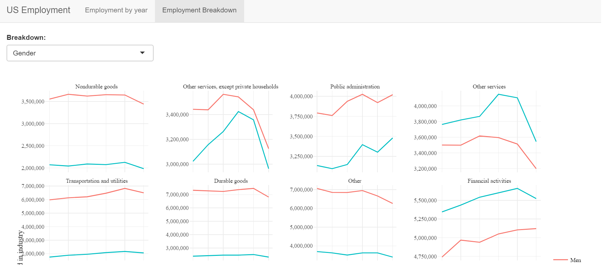

```{r setup, include=FALSE}
knitr::opts_chunk$set(echo = T, warning = F, message = F)

```

# Introduction

This is my first time participating in Tidy Tuesday. What is Tidy Tuesday? As explained in this [website](https://shiny.rstudio.com/gallery/tidy-tuesday.html):

> **Tidy Tuesday** is a weekly social data project in R where users explore a new dataset each week and share their findings on Twitter with \#**TidyTuesday**. ... rocks to learn from the friendly and talented **Tidy Tuesday** community and inspire your next great data visualization!

Yes, data visualization! However, I will focus more on developing Shiny app instead. To start off my first ever Tidy Tuesday, I will explore [Employed Status](https://github.com/rfordatascience/tidytuesday/blob/2e9bd5a67e09b14d01f616b00f7f7e0931515d24/data/2021/2021-02-23/readme.md)

# Exploration

The link of the full script can be found on my [github page](https://github.com/zahiernasrudin/tidytuesday/blob/main/Shiny-Employ/app.R). So here is the summary of the shiny app:

1.  Two sections:

    1.  Employment year: We look at the total employment by year (2015-2020) by industry. For this section, we can filter it by year. This graph is created using ggplot and then ggplotly() is used to make it an interactive plotly graph!

        {width="700"}

    2.  Employment breakdown: This is where we go deeper, and look at either gender, race or by total.

        {width="700"}

# Conclusion

This is a very simple shiny app. I will try to participate in Tidy Tuesday every single week now, because it helps me to improve my data wrangling and shiny skills. Thanks for reading!
